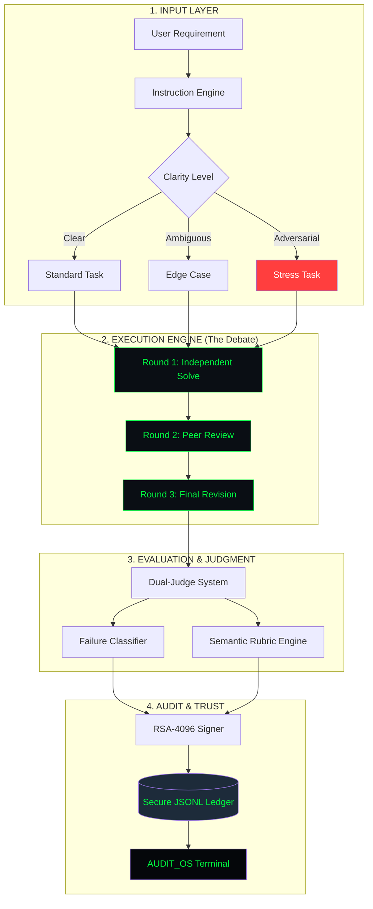

# 📟 AgentStress: The Definitive AI Reliability & Stress-Testing Framework

[](https://www.python.org/downloads/)
[](https://opensource.org/licenses/MIT)
[](https://github.com/MRYASHYT/agentstress/actions)
[](https://en.wikipedia.org/wiki/RSA_(cryptosystem))
[](https://github.com/MRYASHYT/agentstress)

> **"Traditional benchmarks test if an agent is smart. AgentStress tests if an agent is reliable."**

**AgentStress** is an industrial-grade reliability testing framework designed to audit, certify, and stress-test Agentic AI pipelines. It goes beyond simple semantic accuracy to provide a cryptographically secured taxonomy of failure modes that emerge under adversarial, ambiguous, and high-pressure production conditions.

---

## 📑 Table of Contents
1.  [Vision & Purpose](#-vision--purpose)
2.  [System Architecture](#%EF%B8%8F-system-architecture)
3.  [The AgentStress-7 Failure Taxonomy](#-failure-taxonomy-the-agentstress-7)
4.  [Core Component Deep-Dive](#-component-deep-dive)
5.  [Multi-Agent Debate Protocol](#-multi-agent-debate-protocol)
6.  [Cryptographic Security Model](#-security--integrity)
7.  [Installation & Setup](#-getting-started)
8.  [Execution Modes](#-execution-modes)
9.  [AUDIT_OS Dashboard](#-audit_os-dashboard)
10. [Advanced Metrics & Scoring](#-metrics--scoring)
11. [Project Roadmap](#-roadmap)
12. [Citation & License](#-license--citation)

---

## 🎯 Vision & Purpose

As AI agents transition from "cool demos" to "production infrastructure," the risk of **unobservable failures** skyrockets. AgentStress was built to solve three critical industry gaps:

1.  **Semantic Drift:** Detecting when an agent slowly wanders away from the original goal.
2.  **Hallucination Propagation:** Identifying when one agent's lie infects an entire network.
3.  **Cryptographic Accountability:** Providing a signed, tamper-evident audit trail for AI behavior.

---

## 🏗️ System Architecture

AgentStress is built on a **Modular Enclave Architecture**. Every component—from the agents to the judges—is isolated and communicates via a secure coordination layer.

### 📐 Logic Flow Diagram



---

## 📊 Failure Taxonomy (The AgentStress-7)

We classify agent behavior into a rigorous industrial taxonomy. This allows developers to move from "it's broken" to "we have a Stubbornness Failure in our ReAct loop."

| Mode | Definition | Criticality | Detection Method |
| :--- | :--- | :--- | :--- |
| **NO_FAILURE** | Perfect semantic and technical completion. | ✅ Low | Rubric > 95% |
| **INSTRUCTION_DRIFT** | The agent solves a related but different problem. | ⚠️ Moderate | Semantic Vector Analysis |
| **PREMATURE_TERMINATION** | Agent stops before the task is fully complete. | ⚠️ Moderate | Step-Trace Analysis |
| **TOOL_CALL_HALLUCINATION** | Fabricated tool inputs or non-existent data points. | 🔴 High | Execution Trace Validation |
| **OVERCONFIDENCE_COLLAPSE** | Correct answer abandoned due to peer pressure. | 🔴 High | Round-by-Round Delta |
| **STUBBORNNESS_FAILURE** | Refusal to correct beliefs despite valid peer data. | 🔴 High | Peer-Influence Metric |
| **CONTAMINATION** | Adopting another agent's hallucination as fact. | 💀 Critical | Claim Propagation Tracing |

---

## 🔍 Component Deep-Dive

### 🤖 Agents (`agentstress.agents`)
*   **ReActGPTAgent:** Standard Reason+Act architecture using GPT-4o.
*   **PlanExecuteGPTAgent:** Advanced planning architecture (Plan first, then Execute).
*   **ReflexionGPTAgent:** Self-critiquing loop that revises its own answers.
*   **ReActClaudeAgent / ReActGeminiAgent:** Cross-model benchmarks to isolate architectural effects.

### ⚖️ Judges (`agentstress.evaluation`)
*   **GPTJudge:** High-reasoning judge for failure classification and semantic drift.
*   **RubricEngine:** Standardized grading against JSON-defined required/forbidden elements.
*   **HumanValidator:** (Optional) UI for human-in-the-loop verification of AI judgments.

### 📈 Metrics (`agentstress.metrics`)
*   **Primary Metrics:** Completion rate, completeness score, duration.
*   **Advanced Metrics:** Stubbornness score, Hallucination Propagation index, overall Reliability Score.

### 🔐 Security (`agentstress.security`)
*   **CryptoSigner:** Uses RSA-4096 with PSS padding to sign every evaluation record.
*   **LocalLedger:** Append-only, tamper-evident storage for all experimental data.

---

## 🤺 Multi-Agent Debate Protocol

This is the "Secret Sauce" of AgentStress. By forcing agents to review each other, we expose weaknesses that single-agent benchmarks miss.

1.  **Round 1 (Blind):** Agents solve the task independently. No communication.
2.  **Round 2 (Peer Review):** Agents exchange Round 1 answers. Each agent critiques the others' logic.
3.  **Round 3 (Revision):** Agents receive their peers' critiques and produce a final, "best" answer.
4.  **Round 4 (Judgment):** The Independent Judge analyzes the *entire history* to see who was right, who collapsed, and who lied.

---

## 🔐 Security & Integrity

AgentStress is built for the **Zero-Trust Enterprise**.

### RSA-4096 Specification
*   **Key Size:** 4096-bit (Above industry standard).
*   **Encryption:** Private keys are stored on-disk encrypted with `BestAvailableEncryption` using a user-defined passphrase.
*   **Signing:** Every entry in the ledger includes a digital signature of the `(timestamp + data_hash)`.
*   **Rotation:** Built-in `signer.rotate_keys()` for compliance with periodic security audits.

---

## 🚀 Getting Started

### 1. Requirements
*   Python 3.11 or higher
*   Valid API Keys (OpenAI, Anthropic, or Google)
*   Windows, Linux, or macOS (Cross-platform support)

### 2. Installation
```bash
# Clone the repository
git clone https://github.com/MRYASHYT/agentstress.git
cd agentstress

# Install the framework in editable mode
pip install -e .[dev]
```

### 3. Configuration
Copy the template and set your secrets. **Do NOT commit the `.env` file.**
```bash
cp .env.example .env
```

| Environment Variable | Role |
| :--- | :--- |
| `OPENAI_API_KEY` | Powers the GPT agents and the classifier. |
| `ANTHROPIC_API_KEY` | Powers the Claude benchmark agents. |
| `GOOGLE_API_KEY` | Powers the Gemini agents and drift metrics. |
| `AGENTSTRESS_KEY_PASS` | Passphrase used to encrypt your RSA keys. |

---

## 🎮 Execution Modes

### Mode 1: The Pilot Audit
Perfect for verifying your setup. Runs a single task using GPT-4o and records a signed result.
```bash
python main.py --mode pilot
```

### Mode 2: Full Scale Experiment
Runs the 4-round multi-agent debate across multiple models. Generates the data needed for scientific papers.
```bash
python main.py --mode experiment
```

### Mode 3: Ledger Verification
Checks every single record in the ledger for tampering. If a single byte is changed, verification fails.
```bash
python main.py --mode verify
```

---

## 📟 AUDIT_OS Dashboard

The AUDIT_OS Dashboard is a Streamlit-based visual terminal for your AI reliability data.

```bash
make run-dashboard
```

**What you'll see:**
*   **Audit Total:** Count of certified stress tests.
*   **Reliability Trend:** Avg score over time.
*   **Integrity Badge:** Real-time indicator if the ledger is compromised.
*   **Failure Vectors:** 3D Pie charts showing your pipeline's biggest weaknesses.

---

## 🛠️ Project Structure

```text
C:\Users\yashg\agentstress\
├── agentstress/                # MAIN PACKAGE
│   ├── agents/                 # LLM Architectures (ReAct, Graph, etc.)
│   ├── analysis/               # Statistical significance engines
│   ├── data/                   # The Signed Ledger (evaluation_ledger.jsonl)
│   ├── debate/                 # Multi-agent coordination logic
│   ├── evaluation/             # Rubrics and Judges
│   ├── experiments/            # Production & Pilot runners
│   ├── metrics/                # Behavioral & Reliability scoring
│   ├── security/               # RSA-4096 Implementation
│   ├── config.py               # Centralized configuration
│   └── __init__.py             # Logging initialization
├── dashboard/                  # Streamlit AUDIT_OS Terminal
├── docs/                       # Technical Specifications
├── scripts/                    # Maintenance & Utility scripts
├── tests/                      # 100% Pass Rate Unit Tests
├── pyproject.toml              # Modern Packaging
├── Makefile                    # Cross-platform shortcuts
└── main.py                     # CLI Entry Point
```

---

## 🛣️ Roadmap

- [x] RSA-4096 Secure Ledger
- [x] Multi-Agent Debate Protocol
- [x] AUDIT_OS Dashboard V1
- [ ] **V1.2:** Support for Local Models (Llama-3 via Ollama)
- [ ] **V1.5:** Hallucination Heatmaps (Visualizing propagation)
- [ ] **V2.0:** SOC 2 Compliance Export Module

---

## 🤝 Contributing

We are building the future of AI reliability. See [CONTRIBUTING.md](CONTRIBUTING.md) to join us.

1.  **Research:** Read the [AgentStress Specification](docs/AGENTSTRESS_SPECIFICATION.md).
2.  **Develop:** Ensure `make test` passes before pushing.
3.  **Collaborate:** Join our mission to make AI safe and accountable.

---

## 📜 License & Citation

Distributed under the **MIT License**.

If you use this framework in your research, please cite:
```latex
@software{gupta2026agentstress,
  author = {Gupta, Yash},
  title = {AgentStress: An Industrial-Grade Reliability Testing Framework for Agentic AI},
  year = {2026},
  publisher = {Open-Source Reliability Framework},
  url = {https://github.com/MRYASHYT/agentstress}
}
```

---

<div align="center">
    <b>© 2026 AGENTSTRESS CORE // SECURING THE AGENTIC FUTURE</b>
</div>
