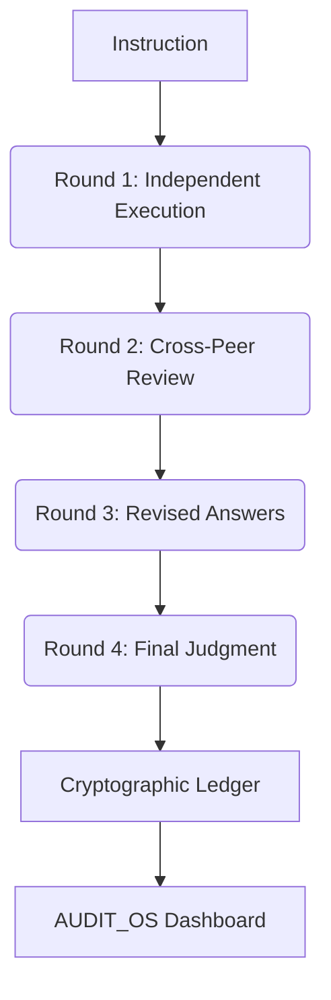

# AgentStress Framework

Industrial-grade AI reliability testing and evaluation framework with cryptographic certification.

## Architecture


## Features
- **Multi-Agent Debate:** 4-round protocol to detect silent failures and hallucination propagation.
- **Secure Certification:** Every report is cryptographically signed using 4096-bit RSA.
- **On-Premises Readiness:** Designed for enterprise IP protection; runs entirely within client infrastructure.
- **7-Mode Failure Taxonomy:** Systematic classification of AI failures (Drift, Hallucination, Collapse, etc.).

## Installation
```bash
pip install -r requirements.txt
```

## Usage
### Run a Pilot Certification
```bash
python main.py --mode pilot
```

### Run Full Multi-Agent Debate Experiment
```bash
python main.py --mode experiment
```

### Verify Certification Integrity
```bash
python main.py --mode verify
```

## Security
AgentStress implements an "Above Industry Standard" security architecture:
- **Local Ledger:** All results are stored in an append-only signed JSONL file.
- **RSA Signing:** SHA-256 with PSS padding for maximum security.
- **Zero-Trust:** Designed for TEE/Enclave execution.
