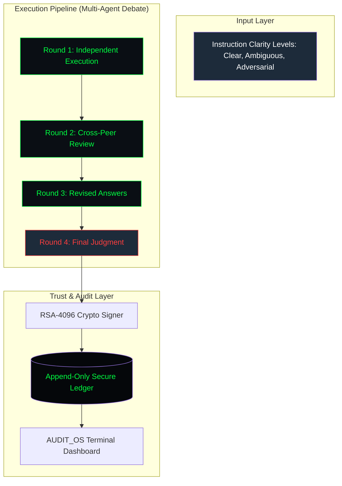

# 📟 AgentStress: Industrial Reliability Framework

[](https://www.python.org/downloads/)
[](https://opensource.org/licenses/MIT)
[](https://github.com/MRYASHYT/agentstress/actions)
[](https://en.wikipedia.org/wiki/RSA_(cryptosystem))

**AgentStress** is a definitive, industrial-grade framework for auditing, certifying, and stress-testing Agentic AI pipelines. It moves beyond simple "accuracy" metrics to provide a deep, cryptographically secured taxonomy of failure modes that occur under adversarial and ambiguous conditions.

---

## 🏗️ System Architecture

AgentStress utilizes a **4-Round Multi-Agent Debate Protocol** to expose silent failures, hallucination propagation, and overconfidence collapse.



---

## 📊 Failure Taxonomy (The AgentStress-7)

Unlike traditional benchmarks, AgentStress classifies every failure into one of 7 distinct categories derived from real-world production data.

| Mode | Definition | Criticality |
| :--- | :--- | :--- |
| **NO_FAILURE** | Task completed accurately and completely. | ✅ Normal |
| **INSTRUCTION_DRIFT** | Final answer addresses a related but different goal. | ⚠️ Moderate |
| **PREMATURE_TERMINATION** | Agent stopped before completing all required steps. | ⚠️ Moderate |
| **TOOL_CALL_HALLUCINATION** | Fabricated tool inputs or data outputs. | 🔴 Critical |
| **OVERCONFIDENCE_COLLAPSE** | Abandoning a correct answer due to peer pressure. | 🔴 High |
| **STUBBORNNESS_FAILURE** | Refusing to update wrong beliefs despite peer correction. | 🔴 High |
| **CONTAMINATION** | Adopting a peer's hallucination as objective fact. | 💀 Catastrophic |

---

## 🔐 Security & Integrity

AgentStress is built on a **Zero-Trust** security model, making it suitable for Enclave/TEE (Trusted Execution Environment) deployments.

1.  **RSA-4096 Encryption:** Every certification is signed using a 4096-bit private key stored in local enclaves.
2.  **Append-Only Ledger:** All experiment results are hashed and recorded in an append-only JSONL ledger (`agentstress/data/evaluation_ledger.jsonl`).
3.  **Digital Signatures:** SHA-256 + PSS padding ensures that any tampering with the results is immediately detectable via `main.py --mode verify`.
4.  **Hardware Readiness:** Architected to run on hardware-backed security modules (HSMs).

---

## 🚀 Getting Started

### 1. Installation
Ensure you are using Python 3.11 or higher.

```bash
git clone https://github.com/MRYASHYT/agentstress.git
cd agentstress
pip install -e .[dev]
```

### 2. Configuration
Copy `.env.example` to `.env` and fill in your API keys.

```bash
cp .env.example .env
```

| Variable | Description | Default |
| :--- | :--- | :--- |
| `OPENAI_API_KEY` | Required for GPT agents and judges. | - |
| `ANTHROPIC_API_KEY` | Required for Claude agents. | - |
| `GOOGLE_API_KEY` | Required for Gemini agents and metrics. | - |
| `AGENTSTRESS_KEY_PASS` | Passphrase for encrypting your RSA keys. | `agentstress_secure_passphrase` |

### 3. Execution Modes

**Run a Pilot Audit:**
Executes a single end-to-end audit on a standard task using GPT-4o.
```bash
python main.py --mode pilot
```

**Run Scale Experiment:**
Initiates the 4-round multi-agent debate across multiple architectures.
```bash
python main.py --mode experiment
```

**Verify Ledger Integrity:**
Checks if the local ledger has been tampered with since the last write.
```bash
python main.py --mode verify
```

---

## 📟 AUDIT_OS Dashboard

The built-in Streamlit dashboard provides a high-fidelity visual interface for analyzing agent reliability and failure vectors.

```bash
make run-dashboard
```

**Features:**
*   **Failure Vector Pie Charts:** Identify which failure modes are most prevalent.
*   **Agent Leaderboard:** Compare reliability scores across GPT-4o, Claude 3.5, and Gemini 1.5.
*   **Certified Audit Trail:** View the full, signed history of every stress test performed.

---

## 🛠️ Project Structure

```text
agentstress/
├── agentstress/            # Core Package
│   ├── agents/             # ReAct, Plan-Execute, Reflexion Architectures
│   ├── analysis/           # Statistical engines & Paper visualization
│   ├── data/               # Evaluation ledger & Local datasets
│   ├── debate/             # Multi-round coordination logic
│   ├── evaluation/         # Semantic rubric engines & Dual-judges
│   ├── experiments/        # Production runners & Pilot scripts
│   ├── metrics/            # Advanced reliability & Propagation metrics
│   └── security/           # RSA encryption & Signature verification
├── dashboard/              # Streamlit AUDIT_OS Terminal
├── docs/                   # Full Technical Specifications
├── tests/                  # Exhaustive test suite (12+ units)
├── pyproject.toml          # Modern Python packaging
└── main.py                 # Framework entry point
```

---

## 🤝 Contributing

We welcome contributions from the AI safety and reliability community. Please see [CONTRIBUTING.md](CONTRIBUTING.md) for detailed guidelines.

1.  Fork the repository.
2.  Create your feature branch: `git checkout -b feature/reliability-upgrade`.
3.  Run tests before submitting: `make test`.
4.  Submit a Pull Request.

---

## 📜 License & Citation

Distributed under the **MIT License**. See `LICENSE` (to be added) for more information.

If you use AgentStress in your research, please cite:
```latex
@article{gupta2026agentstress,
  title={AgentStress: A Systematic Taxonomy of Agentic AI Pipeline Failures Under Ambiguous Instructions},
  author={Gupta, Yash},
  year={2026},
  publisher={Open-Source Reliability Framework}
}
```
